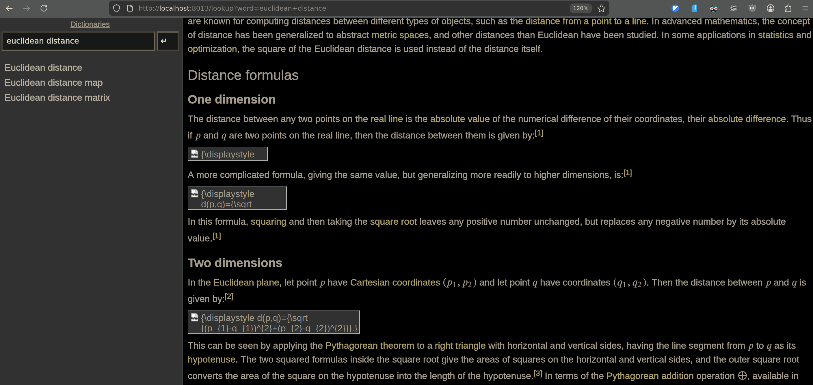

This is a proxy for [slobby](https://github.com/itkach/slobby); it extracts the math definitions from the "alt" field of non-inline math images, and uses Mathjax to render them.

Before, with just slobby:

After, over this mathjax_proxy.py:

Usage is drop-dead simple:

    make

It will build a Docker container with both slobby and the Mathjax proxy filter, and launch them both.

Visit [http://localhost:8014](http://localhost:8014) to access the end result.

The docker image is "only" 247MB, which I suppose is an achievement these days :-)

Hope this helps someone!
